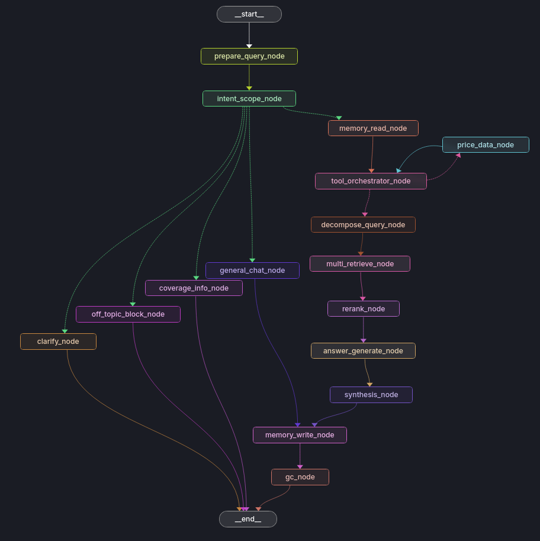

# Finance RAG LangGraph

Projet RAG financier cohérent de bout en bout pour analyser des rapports SEC (10-K/8-K) avec:

- stratégie unique: **semantic chunking + vector retrieval + reranking**
- pipeline **LangGraph** à noeuds séparés
- mémoire conversationnelle avec **garbage collector** de contexte
- double backend LLM: **OpenAI API** ou **GitHub Models**
- UI Streamlit et packaging Docker

## Mode conversationnel

L'interface se comporte comme un chatbot:

- historique multi-tours visible dans la session (style ChatGPT/Gemini)
- mémoire courte + résumé interne du contexte
- affichage des sources et métriques par réponse
- si la question est trop ambiguë (sans entreprise/période), le bot pose une clarification
- sinon il lance une recherche multi-entreprises et fait une synthèse globale

## Structure

- `rag/download_SEC_reports.py`: téléchargement SEC dans `data/`
- `rag/preprocess.py`: extraction sections (Item 1A/7/8) vers `rag/processed_data/`
- `rag/hybrid_rag.py`: indexation vectorielle Chroma + retrieval/reranking
- `rag/langgraph_flow.py`: graphe nodal (prepare, memory, retrieve, rerank, generate, synthesis, memory write, gc)
- `rag/llm_provider.py`: couche provider OpenAI/GitHub Models
- `ui/app_rag.py`: chatbot Streamlit branché sur LangGraph

## Univers suivi et documents utilises

### Entreprises suivies (tickers)

`NVDA`, `INTC`, `AMD`, `PLTR`, `GOOGL`, `META`, `AMZN`, `MSFT`, `AVGO`, `ORCL`

### Documents ingeres actuellement

- `10-K` (rapport annuel)
- `8-K` limites a l'item `2.02` (publication de resultats)
- transcripts d'earnings calls en `.txt` (si le nom contient `earnings_call`, `conference_call` ou `transcript`)
- sections extraites au preprocess (par defaut): `Item 1A` et `Item 7`
- section optionnelle: `Item 8` (si activee via `--sections 1a,7,8`)

### Documents non ingeres dans cette version

- `10-Q` (trimestriel)
- investor presentations / communiques hors SEC

### Consequence sur la pertinence

Le chatbot est coherent sur l'analyse fondamentale long-terme, mais il est moins complet pour le suivi court-terme tant que `10-Q` et transcripts ne sont pas ajoutes.

## Configuration

1. Copier le template:

```bash
cp .env.example .env
```

2. Renseigner les variables nécessaires dans `.env`:

- `LLM_PROVIDER=openai` ou `LLM_PROVIDER=github_models`
- OpenAI:
  - `OPENAI_API_KEY`
  - `OPENAI_CHAT_MODEL` (défaut: `gpt-4o-mini`)
  - `OPENAI_EMBEDDING_MODEL` (défaut: `text-embedding-3-small`)
- GitHub Models:
  - `GITHUB_MODELS_API_KEY`
  - `GITHUB_CHAT_MODEL` (défaut: `openai/gpt-4o-mini`)
  - `GITHUB_EMBEDDING_MODEL` (défaut: `text-embedding-3-small`)
- LangSmith (visualisation):
  - `LANGSMITH_TRACING=true`
  - `LANGSMITH_API_KEY`
  - `LANGSMITH_PROJECT`
- SEC:
  - `SEC_USER_AGENT` (obligatoire pour crawler SEC)

## Lancement local

### 1) Installer les dépendances

```bash
python3 -m venv .venv
source .venv/bin/activate
pip install -r requirements.txt
```

### 2) Ingestion SEC (optionnel si vous avez déjà des fichiers dans `data/`)

```bash
python3 rag/download_SEC_reports.py
```

### 3) Pré-traitement

```bash
python3 rag/preprocess.py --sections 1a,7 --min-year 2021
```

### 4) Planifier l'indexation

```bash
python3 rag/hybrid_rag.py --plan --strategy semantic
```

### 5) Indexer les embeddings

```bash
python3 rag/hybrid_rag.py --embed --strategy semantic --quota-used 0
```

Pour un temps d'indexation raisonnable, utilisez les embeddings en batch:

```bash
python3 rag/hybrid_rag.py --embed --strategy semantic --quota-used 0 --batch-size 32 --rpm 120
```

### 6) Lancer l'UI

```bash
streamlit run ui/app_rag.py
```

## Lancement Docker (recommandé)

```bash
docker compose run --rm bootstrap
docker compose up finance-rag-ui
```

L'UI est disponible sur `http://localhost:8501`.

Le service `bootstrap` exécute:

1. téléchargement SEC (optionnel selon flags)
2. preprocess
3. embedding

Flags `.env` utiles:

- `SKIP_DOWNLOAD_IF_EXISTS=true`
- `SKIP_PREPROCESS_IF_EXISTS=false`
- `BOOTSTRAP_MIN_YEAR=2021`
- `BOOTSTRAP_SECTIONS=1a,7`
- `EMBEDDING_DAILY_LIMIT=0` (`0` = quota illimite)
- `EMBEDDING_BATCH_SIZE=32`
- `EMBEDDING_MAX_RETRIES=3`
- `EMBEDDING_RPM=120`
- `QUERY_DECOMPOSE_COUNT=4` (nombre de sous-requêtes générées par LangGraph)
- `PRICE_TOOL_ENABLED=true`
- `PRICE_MAX_DAYS=180`
- `PRICE_MAX_POINTS=40`
- `PRICE_MAX_TICKERS=3`
- `PRICE_DEFAULT_DAYS=90`
- `PRICE_MAX_ATTEMPTS=2`

## Architecture LangGraph

<p align="center">
  
</p>

Le graphe exécute les tâches dans cet ordre:

1. `prepare_query_node`
2. `intent_scope_node`
3. `clarify_node` (si ambigu) ou `memory_read_node`
4. `tool_orchestrator_node` (décide si l'outil prix doit être appelé)
5. `price_data_node` (outil prix, contextuel, avec tentatives limitées)
6. retour `tool_orchestrator_node` puis `decompose_query_node`
7. `multi_retrieve_node`
8. `rerank_node`
9. `answer_generate_node`
10. `synthesis_node`
11. `memory_write_node`
12. `gc_node`

Le `gc_node` compresse l'historique pour limiter le coût token/API et maintient une fenêtre glissante de conversation.

## Visualisation LangSmith

Les noeuds du graphe sont instrumentés via `@traceable`.  
Une fois `LANGSMITH_TRACING=true` et `LANGSMITH_API_KEY` définis, chaque run est visible dans le projet `LANGSMITH_PROJECT`.

### Lancer et visualiser

1. Activer les variables dans `.env`:
   - `LANGSMITH_TRACING=true`
   - `LANGSMITH_API_KEY=...`
   - `LANGSMITH_PROJECT=finance-rag-langgraph`
2. Lancer l'app Streamlit et poser des questions.
3. Ouvrir [https://smith.langchain.com](https://smith.langchain.com), puis le projet `LANGSMITH_PROJECT`.

### LangGraph Studio (optionnel)

Pour visualiser localement le graphe en mode dev:

```bash
pip install langgraph-cli
langgraph dev --config langgraph.json
```